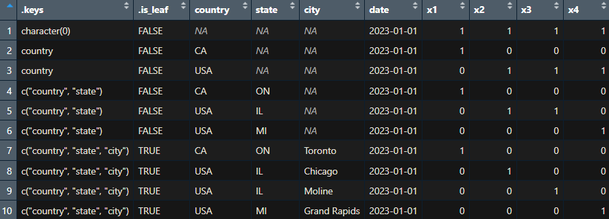
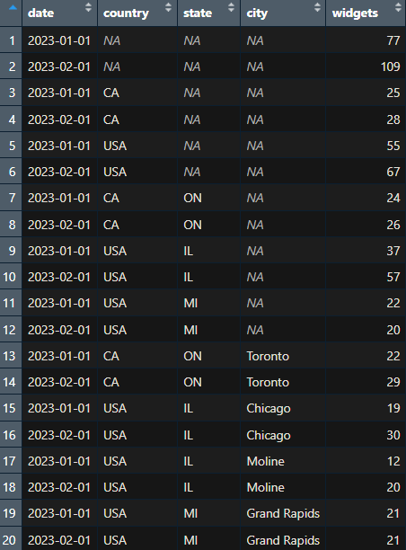

# reconcileR

<!-- badges: start -->
[](https://lifecycle.r-lib.org/articles/stages.html#experimental)
[](https://github.com/prognostic8R/reconcileR/actions/workflows/R-CMD-check.yaml)
<!-- badges: end -->

`reconcileR` is an `R` package which simplifies the process of forecast reconciliation.

The purpose of forecast reconciliation is to support forecasting at various levels of 
data aggregation (e.g., product totals, store totals, product within store totals) and combining the 
different forecasts into one coherent forecast such that the sum of the lowest-level forecasts 
equals the highest level forecast.

This approach of forecasting at different levels of data aggregation and then reconciling almost always 
results in improved forecast accuracy.

The goal of this package is to facilitate the creation of modular reconciliation matrices such that they can be used 
with any forecast, whether it was produced within `R` or not. As such, this package is not opinionated when it 
comes to function inputs and avoids classes and attributes.

## Installation

You can install the development version of `reconcileR` with:

``` r
if (FALSE) install.packages("remotes")
remotes::install_github("prognostic8R/reconcileR")
```

## Examples

### Example 1: An interpretable sum matrix

* A call to `sum_matrix(.return = "tibble")` will clearly show how the various data 
aggregations given in the `keys` argument relates to the sum matrix which begins at 
`x1`. A call to `sum_matrix(.return = "matrix")` will return just the numeric sum matrix 
as a `matrix`.

* `sum_matrix(.return = "tibble")` function return:

    + `.keys` (list): Gives the forecast hierarchy in the input data set in `data`. A value 
of `character(0)` would indicate that all grouping keys in the forecast data are `NA`, that is, that the forecast was produced at the highest level of aggregation which would be `index`.

    + `.is_leaf` (logical): A value of `TRUE` indicates the lowest level of the forecast hierarchy. 
    After forecasts are reconciled across forecast hierarchies, it's the forecasts at these granular leaves 
    that are aggregated to produce coherent reconciled forecasts at any level desired.
    
    + `keys` and `index`: The data set column names passed in `sum_matrix(keys = "", index = "")` are returned as-is.
    
    + `x1:xN`: The columns labeled x1, x2, ..., xN are the sum matrix.

``` r
library(reconcileR)
library(dplyr)

data <- get(data(widgets, package = "reconcileR"))

keys <- c("country", "state", "city")
index <- "date"

sum_matrix <- reconcileR::sum_matrix(
  data = data %>% dplyr::filter(!!rlang::sym(index) == min(!!rlang::sym(index))),
  keys = keys,
  index = index,
  .return = "tibble"
)

sum_matrix
```



### Example 2: Hierarchical forecast reconciliation

Below is an example of hierarchical forecast reconciliation. We'll use the `sum_matrix()` function 
to capture the hierarchical structure of the `widgets` forecast data set, followed by a simple 
non-weighted forecast reconciliation.

``` r
library(reconcileR)
library(dplyr)
library(ggplot2)

data <- get(data(widgets, package = "reconcileR"))

data
```



``` r
keys <- c("country", "state", "city")
index <- "date"
outcome <- "widgets"

dates <- unique(data[[index]])

dates
```

Because hierarchical 
forecast reconciliation requires one summation matrix for each forecast date, we'll loop over the 
forecast dates and reconcile the forecasts across all levels of the hierarchy one date at a time.

Calling `sum_matrix()` once per forecast date instead of abstracting this loop away 
within a single call to `sum_matrix()` is a design choice that gives the user more control.

``` r
sum_matrices <- lapply(dates, function(date) {

  reconcileR::sum_matrix(
    data = data %>% dplyr::filter(!!rlang::sym(index) == !!date),
    keys = keys,
    index = index,
    .return = "matrix"
    )
})

sum_matrices[[1]]
```

* Matrix multiplication.

``` r
data_reconciled <- lapply(seq_along(dates), function(i) {

  data <- data %>% dplyr::filter(!!rlang::sym(index) == !!dates[i])
  sum_matrix <- sum_matrices[[i]]

  y <- data[[outcome]]
  weight_matrix <- diag(length(y))
  g_matrix <- solve(t(sum_matrix) %*% solve(weight_matrix) %*% sum_matrix) %*% 
      t(sum_matrix) %*%
      solve(weight_matrix)

  data[[paste0(outcome, "_reconciled")]] <- as.vector(sum_matrix %*% g_matrix %*% y)

  return(data)
}) %>%
  dplyr::bind_rows()

data_reconciled
```

* Plotting

``` r
data_reconciled <- data_reconciled %>%
  tidyr::pivot_longer(
    cols = tidyselect::all_of(c(outcome, paste0(outcome, "_reconciled"))),
    names_to = ".outcome",
    values_to = ".forecast"
    ) %>%
  dplyr::rowwise() %>%
  dplyr::mutate(.keys = list({{keys}}[!is.na(dplyr::cur_data() %>% dplyr::select({{keys}}))])) %>%
  tibble::as_tibble() %>%
  dplyr::group_by(!!rlang::sym(index), .keys, .outcome) %>%
  dplyr::mutate(.forecast_agg = sum(.forecast, na.rm = TRUE))

data_reconciled$.keys <- sapply(data_reconciled$.keys, function(x) paste(x, collapse = " * "))

data_reconciled$.keys <- with(data_reconciled, dplyr::if_else(.keys == "", "no agg keys", .keys))

data_reconciled$.keys <- factor(data_reconciled$.keys, levels = unique(data_reconciled$.keys))

p <- ggplot(data_reconciled, aes(ordered(eval(parse(text = index))), .forecast_agg, fill = .outcome))
p <- p + geom_col(position = position_dodge(width = 0.9), alpha = .8)
p <- p + geom_label(aes(label = round(.forecast_agg, 1)), position = position_dodge(width = 0.9), color = "black", show.legend = FALSE)
p <- p + facet_wrap(~ .keys, ncol = 4)
p <- p + theme_bw() + theme(
  axis.text.x = element_text(angle = 45, hjust = 1)
)
p <- p + xlab("Date") + ylab("Widgets forecast") + labs("") +
  ggtitle("Total Widget Forecast Comparison by Forecast Hierarchy")
p
```


